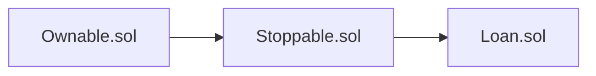

 

# LOANΞR 
> Final Project for the Developers Program by **Consensys Academy**
> by **Ali Kalkanel**

**Loaner** is a lending ÐApp that allows one to create a **loan** and/or **borrow** ETH via the *LOANΞR* platform. This allows people to create peer to peer lending agreements in a secure and transparent way using Blockchain and Smart Contracts. Removing the need for banks to be the only available option for borrowing. Without borrowing against collateral, *LOANΞR* grants users a flexible way to create and borrow in a hassle-free manner.


## Prerequisites 
> To engage with **LOANΞR** you will need the following :

* NodeJS ([https://nodejs.org/en/](https://nodejs.org/en/))
	> npm install nodejs
* Ganache([https://www.trufflesuite.com/ganache](https://www.trufflesuite.com/ganache))
	>npm install ganache-cli -g
* Truffle([https://www.trufflesuite.com/truffle] (https://www.trufflesuite.com/truffle))
	> npm install truffle
* Metamask (Chrome Extension) 🦊
	> Metamask is a chrome extension that helps you interact with web pages that want access to a (your) Ethereum wallet.

## Configuring Truffle
> **Truffle** is a development environment, testing framework and asset pipeline for **Ethereum**, aiming to make life as an **Ethereum** developer easier.

The project folder will contain a `truffle-config.js` file which is the configuration file, located at the root of the project directory. 
```javascript
module.exports = {
  networks: {
    development: {
      host: "localhost",
      port: 8545,
      network_id: "*" // Match any network id
    }
  }
};
```
The default configuration ships with configuration for a single development network, running on  `127.0.0.1:8545`. There are many other configuration options, you can find more details on the official website:([https://www.trufflesuite.com/docs/truffle/reference/configuration](https://www.trufflesuite.com/docs/truffle/reference/configuration)).


## Configuring Ganache 

>Ganache is a virtual blockchain which sets up 10 default Ethereum addresses, complete with private keys, and pre-loads them with 100 simulated Ether each. Ganache comes in two flavors: CLI and UI. I *recommend* UI for visibility, and simplicity 

Ganache will default to a certain Port and IP address.  **We'll be using 8545**. *To change these settings, *click* the ⚙️ icon situated at the top right of the Ganache GUI window, under **server**.* 

>**Note:** Double check the RPC Address, Port and Network ID matching with the **truffle-config.js** file in the root directory. 
>
>**⚠️ Caution:** There may be a nonce sync issue thus you may need to reset the account if you run the ÐApp multiple time across different browser sessions. To do this click the MetaMask extension Icon ( 🦊) > click on the **colourful avatar** >  go to **settings** (⚙️) > click **Advanced** > finally, **Reset Accounts**. Also refresh the page so that these changes have been updated.
>

## Configuring MetaMask 🦊

If you're entirely new to **MetaMask** I recommend quickly reading [this introduction](https://bitfalls.com/2018/02/16/metamask-send-receive-ether/).

Having configured your Truffle & Ganache settings correctly, you'll need to add a new network by clicking **`Custom RPC`**, entering the correct **`RPC SERVER URL`**, and optionally, the network name.

> **Note:** You can find the `RPC SERVER URL` just above your mnemonic key, it should read HTTP://127.0.0.1:8545.

 As mentioned above Ganache sets up 10 default Ethereum addresses, including their private keys with pre-loaded test Ether. You can import your Ganache generated accounts (assuming it's pointing at the correct network) by logging out of MetaMask and selecting `Import using account seed phrase` where you'll paste your mnemonic provided by Ganache. 
 
## Deployment
>  Assuming you have set up all of the above correctly, with a test-net in the back running on port 8545, we can continue and deploy our main contract.
>  
Use truffle to migrate the main contract `Loan.sol`. This can be done by running the following commands in the root directory of the project:

> $ truffle migrate

Then we change into the client directory by executing `cd client` and install the neccessary modules by executing the following command:
> $ npm install
>
Having successfully installed everything within the client directory, we execute `npm start` to boot up the front-end locally.

##  Unit Tests
To test with truffle you can execute the following command:
> $ truffle test


> **Caution:** In the case that you receive an error stating that it  **`cannot find module 'bignumber.js'`**, it may be the case that you will have to run **`npm install bignumber.js`** In the root directory.

There are a total of 14 tests, and in the time of writing, all pass. These tests can be found within the `test` folder under `testLoan.js`.
## LOANΞR functionality

 **Retrieve Loan** - Each loan that gets created is assigned a unique ID that ascends sequentially, such that the first loan that gets created will have an `ID` of 1. With this `ID` we are then able to read the blockchain and retrieve successfully created loans that point to that `ID`. In the case that the Loan has not been created, our search will render 0 values with a status of `PENDING`. 
 
**Create Loan** - Allows the user to create a loan by providing an `interest amount`, `borrowers address`, `deposit percentage`, and lastly the `value of the loan` in ETH. The borrower's address cannot be a 0 address (0x0), and the value of the loan must be larger than 0. The `Create Loan` button will submit these entered fields to MetaMask where you will be prompted with a window to confirm the transaction. Should your Loan be successful, you will be able to retrieve it via it's `ID`.

**Pay Deposit** - Allows the assigned borrower to pay the deposit of the loan in which his/hers address was assigned to. During the Loan creation, the lender would have specified the `Deposit Required` which is a calculated percentage of the total amount of the loan. The borrower retrieves the loan, which states the required ETH to pay the deposit, this will then be submitted by the borrower of that particular loan. The borrower will then be prompted with a MetaMask window to confirm this transaction. Once confirmed and successful, the `Loan Status` will change to `ACTIVE`. This indicates that the Loan is now in motion

**Retrieve Funds** - This allows the borrower to then retrieve the value of the loan which was set by the Lender, after having paid the initial Loan deposit. Only the borrower assigned to that Loan is allowed to retrieve the Loan funds set by the Lender.

**Pay Off Loan** - This allows the borrower to then pay back the loan minus the deposit paid. The borrower can obtain the required amount to be paid by looking up his loan using the `ID`. Within the loan details table, the required amount to pay off the loan will be under `Full Loan Amount`. Once the borrower has paid this amount, he will again be prompted by MetaMask to confirm this transaction, once the transaction has successfully been processed, the `Loan Status` will change to `RESOLVED`, indicating the maturity of the loan.

## Contract Inheritance Flow Chart

